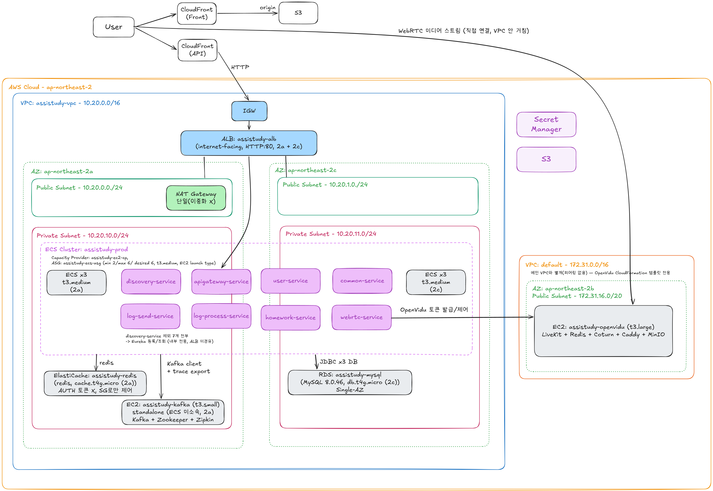
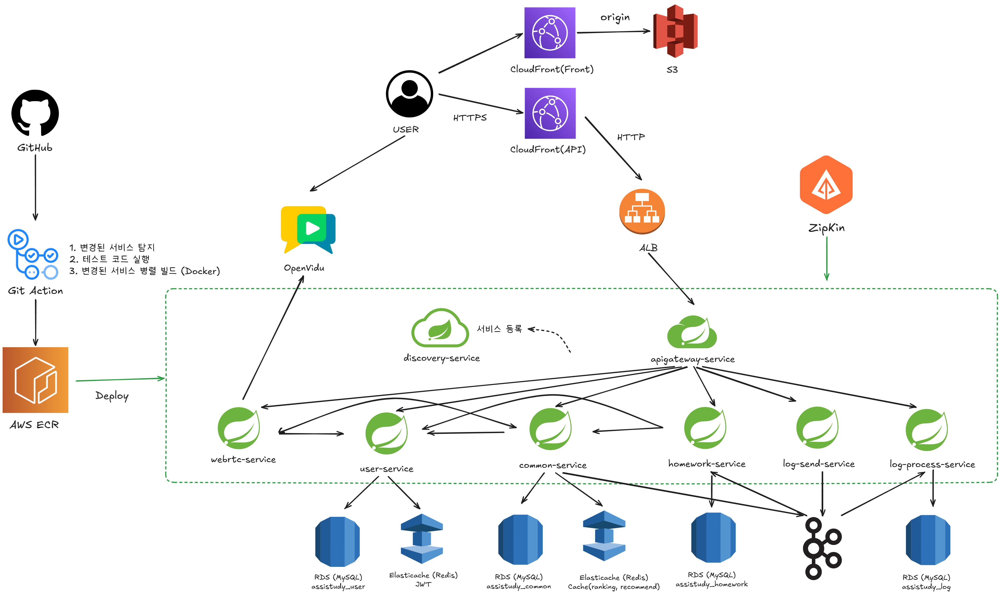

# assistudy-toy — Backend

실시간 화상 스터디 플랫폼(방 생성/참가, 화상회의, 과제/피드백, 학습시간 집계)의 백엔드입니다. 원래는 단일 구조로 시작해 도메인별 서비스 분리, 성능 개선, 관측성(Observability) 확보, 무중단 배포, SAGA 기반 분산 트랜잭션까지 단계적으로 리팩토링한 Spring Cloud MSA 프로젝트입니다.

- 리팩토링 이전 상태가 궁금하다면 → [JH627/assistudy](https://github.com/JH627/assistudy)
- 이슈/PR/마일스톤 전체 이력 → [Milestones](https://github.com/assistudy-toy/BE/milestones?state=closed)

## 아키텍처

### AWS 인프라



### 서비스 흐름 (논리 아키텍처)



## 서비스 구성

| 서비스                | 포트 | 역할                                                                                                          |
| --------------------- | ---: | ------------------------------------------------------------------------------------------------------------- |
| `apigateway-service`  | 8080 | Spring Cloud Gateway(WebFlux). 라우팅, JWT 인증, Redis 기반 rate limiting, 보안 헤더, 재시도 필터             |
| `discovery-service`   | 8761 | Eureka Server (Basic Auth 보호)                                                                               |
| `user-service`        | 8082 | 회원/인증(OAuth2, JWT RS256 RS Rotation), Redis                                                               |
| `common-service`      | 8081 | 스터디룸, 참가자, 학습시간 집계/랭킹, 방 추천. Redis 캐싱, Resilience4j Circuit Breaker, Kafka 프로듀서(SAGA) |
| `homework-service`    | 8086 | 과제/피드백 (common-service에서 분리). Kafka 컨슈머(SAGA), 자체 DB                                            |
| `webrtc-service`      | 8087 | LiveKit(OpenVidu 3.x) 기반 화상회의 토큰 발급 및 방 프로비저닝                                                |
| `log-send-service`    | 8085 | 클라이언트 학습 로그 수신 → Kafka 프로듀서                                                                    |
| `log-process-service` | 8084 | Kafka 컨슈머, Java Streams 기반 로그 분석/집계 배치                                                           |
| `shared`              |    - | 공용 라이브러리 모듈(공통 응답/예외, JWT 리졸버, 내부 인증 필터 등)                                           |

## 기술 스택

- **Language / Runtime**: Java 21, Spring Boot 4.0.2, Spring Cloud 2025.1.1
- **Build**: Gradle 멀티 모듈 (root `settings.gradle` + `build.gradle`)
- **API / 통신**: Spring MVC, Spring Cloud Gateway(WebFlux), OpenFeign, Spring gRPC(`spring-grpc-*`, common-service ↔ user-service 옵션 전환 지원)
- **비동기 메시징**: Apache Kafka(Confluent 이미지, 직접 EC2 호스팅) — 로그 파이프라인, 방 삭제/생성 SAGA
- **데이터**: MySQL 8.0(RDS, 서비스별 DB 분리), Redis 7(ElastiCache) — 캐싱 + rate limiting
- **인증/보안**: JWT(RS256, Access/Refresh Rotation), OAuth2(Kakao/Naver), Spring Security, 서비스 간 내부 호출 인증 필터
- **화상회의**: LiveKit(OpenVidu 3.x, 자체 호스팅 EC2)
- **회복탄력성**: Resilience4j Circuit Breaker (fail-open/fail-closed/재throw를 호출 성격에 따라 다르게 설계)
- **분산 트랜잭션**: SAGA — 방 삭제(Choreography, Kafka 재시도+DLQ), 방 생성(보상 트랜잭션)
- **관측성**: Micrometer Tracing + Brave + Zipkin(분산 트레이싱), Micrometer + Prometheus(메트릭, `/actuator/prometheus`), Grafana/Alertmanager(로컬 docker-compose)
- **부하 테스트**: k6 (`k6/scenarios`, `k6/results`)
- **인프라**: AWS(ECS EC2 + Capacity Provider/ASG, RDS, ElastiCache, ALB, CloudFront+S3, ECR, self-hosted Kafka/LiveKit EC2), Docker
- **CI/CD**: GitHub Actions — 변경된 서비스만 감지해 테스트→빌드→ECR 푸시→ECS 순차 배포(discovery → core → gateway), 이미지는 커밋 SHA로 고정해 롤백 가능

## 프로젝트 진행 과정 (마일스톤 순)

### [기존 프로젝트 세팅](https://github.com/assistudy-toy/BE/milestone/1)

- [#2](https://github.com/assistudy-toy/BE/issues/2) 기존 프로젝트 코드 이관 — [PR #3](https://github.com/assistudy-toy/BE/pull/3)

### [시스템 아키텍처 재설계 및 불필요 인프라 제거](https://github.com/assistudy-toy/BE/milestone/2)

- [#4](https://github.com/assistudy-toy/BE/issues/4) Config Server 제거(서비스별 yml 직접 관리로 전환) — [PR #5](https://github.com/assistudy-toy/BE/pull/5)
- [#6](https://github.com/assistudy-toy/BE/issues/6) Spark 의존성 제거(Java Streams로 로그 분석 대체) — [PR #7](https://github.com/assistudy-toy/BE/pull/7)

### [서비스 안정성 및 보안 개선](https://github.com/assistudy-toy/BE/milestone/3)

- [#8](https://github.com/assistudy-toy/BE/issues/8) 학습시간 측정 오류 수정 — [PR #9](https://github.com/assistudy-toy/BE/pull/9)
- [#10](https://github.com/assistudy-toy/BE/issues/10) 플랫폼 보안 아키텍처 강화(JWT RS256 Rotation, OAuth2 nonce 코드 교환, Eureka Basic Auth, rate limiting 등) — [PR #11](https://github.com/assistudy-toy/BE/pull/11)
- [#12](https://github.com/assistudy-toy/BE/issues/12) 멀티 모듈 구조 도입(`shared` 모듈 분리) — [PR #13](https://github.com/assistudy-toy/BE/pull/13)

### [모니터링 도입](https://github.com/assistudy-toy/BE/milestone/6)

- [#14](https://github.com/assistudy-toy/BE/issues/14) 분산 추적 도구(Zipkin) 추가 — [PR #15](https://github.com/assistudy-toy/BE/pull/15)
- [#16](https://github.com/assistudy-toy/BE/issues/16) Prometheus/Grafana + 알림 파이프라인 추가 — [PR #17](https://github.com/assistudy-toy/BE/pull/17)
- [#18](https://github.com/assistudy-toy/BE/issues/18) k6 부하 테스트 시나리오 추가 — [PR #19](https://github.com/assistudy-toy/BE/pull/19)

### [배포 파이프라인 구축 및 배포](https://github.com/assistudy-toy/BE/milestone/7)

- [#20](https://github.com/assistudy-toy/BE/issues/20) Dockerfile 추가, AWS ECS/EC2 최초 배포 — [PR #21](https://github.com/assistudy-toy/BE/pull/21)

### [서비스 성능 개선](https://github.com/assistudy-toy/BE/milestone/5)

- [#22](https://github.com/assistudy-toy/BE/issues/22) API 성능 개선(쿼리 최적화/인덱싱) — [PR #23](https://github.com/assistudy-toy/BE/pull/23)
- [#24](https://github.com/assistudy-toy/BE/issues/24) Redis 캐싱 적용(랭킹/방 추천) — [PR #25](https://github.com/assistudy-toy/BE/pull/25)

### [도메인 별 서버 분리](https://github.com/assistudy-toy/BE/milestone/4)

- [#26](https://github.com/assistudy-toy/BE/issues/26) Redis 캐싱 효과 검증 및 CB/gRPC 도입 전 baseline 측정 — [PR #27](https://github.com/assistudy-toy/BE/pull/27)
- [#28](https://github.com/assistudy-toy/BE/issues/28) Resilience4j Circuit Breaker 적용 — [PR #29](https://github.com/assistudy-toy/BE/pull/29)
- Feign 클라이언트 `@Primary` 충돌 버그 수정 — [PR #30](https://github.com/assistudy-toy/BE/pull/30)
- [#31](https://github.com/assistudy-toy/BE/issues/31) gRPC 전환(REST/gRPC 런타임 전환 가능하게 구성, baseline 비교용) — [PR #32](https://github.com/assistudy-toy/BE/pull/32)
- [#33](https://github.com/assistudy-toy/BE/issues/33) 테스트 코드 추가(Testcontainers 기반 통합테스트) — [PR #34](https://github.com/assistudy-toy/BE/pull/34)
- [#35](https://github.com/assistudy-toy/BE/issues/35) common-service 분리(homework-service/webrtc-service 독립) — [PR #36](https://github.com/assistudy-toy/BE/pull/36)
- [#37](https://github.com/assistudy-toy/BE/issues/37) 변경된 서비스만 빌드/배포하는 CI 파이프라인 개선 — [PR #38](https://github.com/assistudy-toy/BE/pull/38)

### [추가 개선](https://github.com/assistudy-toy/BE/milestone/8)

- [#39](https://github.com/assistudy-toy/BE/issues/39) 무중단 배포 개선(컨테이너 헬스체크, SHA 고정 이미지, 게이트웨이 재시도 필터) — [PR #41](https://github.com/assistudy-toy/BE/pull/41)
- [#40](https://github.com/assistudy-toy/BE/issues/40) 분산 트랜잭션 처리를 위한 SAGA 패턴 도입
  - Choreography(방 삭제, Kafka 재시도+DLQ) — [PR #42](https://github.com/assistudy-toy/BE/pull/42)
  - 보상 트랜잭션(방 생성, LiveKit 프로비저닝 실패 시 롤백) — [PR #43](https://github.com/assistudy-toy/BE/pull/43)

## 로컬 개발 환경

```bash
# 인프라(MySQL/Redis/Kafka) 기동
docker compose -f docker-compose.infra.yml up -d

# 각 서비스 실행 (SPRING_PROFILES_ACTIVE=local)
./gradlew :discovery-service:bootRun
./gradlew :user-service:bootRun
./gradlew :common-service:bootRun
# ...
```

- 서비스별 설정: `application.yml`(공통) + `application-{local,dev,prod}.yml`(프로파일별)
- 환경변수 목록: `.env.example` 참고

## 부하 테스트 / 성능 측정

`k6/scenarios/`에 시나리오별 스크립트, `k6/results/`에 실제 측정 결과(raw JSON/HTML + 분석 리포트)를 보관합니다.

## 배포

GitHub Actions(`​.github/workflows/deploy.yml`)가 `main` push마다 변경된 서비스를 감지해 테스트 → 이미지 빌드/ECR 푸시 → ECS 순차 배포(discovery → core 서비스 → gateway)까지 자동 수행합니다. 필요한 Secrets/IAM 정책은 [`.github/workflows/README.md`](.github/workflows/README.md) 참고.
